<h2>Tensorflow-Image-Segmentation-Augmented-GlaS-MICCAI2015 (2024/07/24)</h2>

This is the first experiment of Image Segmentation for 
<a href="https://www.kaggle.com/datasets/sani84/glasmiccai2015-gland-segmentation">GlaS@MICCAI'2015: Gland Segmentation</a> based on
the <a href="https://github.com/sarah-antillia/Tensorflow-Image-Segmentation-API">Tensorflow-Image-Segmentation-API</a>,  
In this experiment, we aim to demonstrate that online augmentation of the dataset is effective in improving the generalization performance 
of a deep learning model for image segmentation. 
The number of images and annotation files of the original <a href="https://www.kaggle.com/datasets/sani84/glasmiccai2015-gland-segmentation">GlaS@MICCAI'2015: Gland Segmentation</a>
is really very small as shown below. 
<pre> 
bmp files :    165
ann_bmp files: 165
</pre>

Therefore, in this experiment, we employed an online augmentation strategy to improve segmentation accuracy.
We applied the following image transformation methods to the original dataset to augment them during our trainging process. 
<ul>
<li>horizontal flipping</li>
<li>vertical flipping</li>
<li>rotation</li>
<li>shrinking</li>
<li>shearing</li>
<li>deformation</li>
<li>distortion</li>
<li>barrel distortion</li> 
</ul>
For more details, please refer to <a href="./src/ImageMaskAugmentor.py">ImageMasukAugmentor.py</a>. 
As demonstrated in our experiment <a href="https://github.com/sarah-antillia/Tensorflow-Image-Segmentation-Augmented-White-Blood-Cell">
Tensorflow-Image-Segmentation-Augmented-White-Blood-Cell</a>, these augmentation methods are also 
expected to be effective in improving segmentation accuracy for this even smaller dataset.
 

<b>Actual Image Segmentation</b> 
The inferred green-colorized masks predicted by our segmentation model trained on the GlaS-MICCAI2015 ImageMaskDataset appear similar 
to the ground truth masks.
<table>
<tr>
<th>Input: image</th>
<th>Mask (ground_truth)</th>
<th>Prediction: inferred_mask</th>
</tr>
<tr>
<td>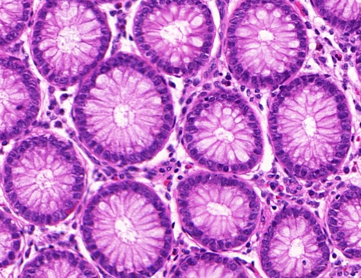</td>
<td>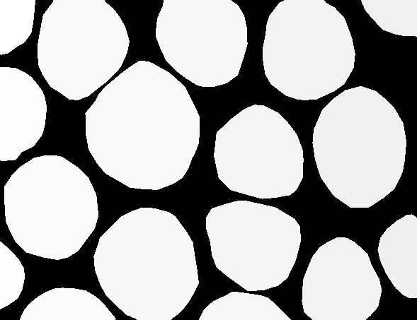</td>
<td>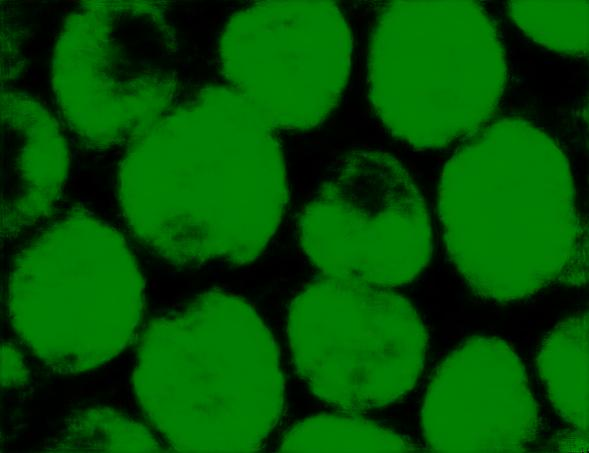</td>
</tr>
<tr>
<td>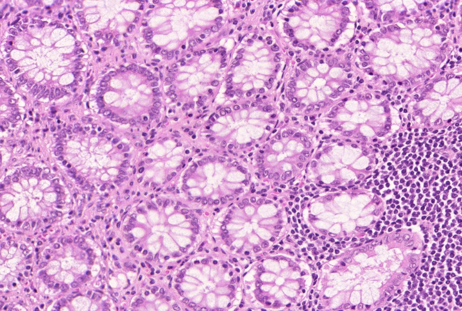</td>
<td>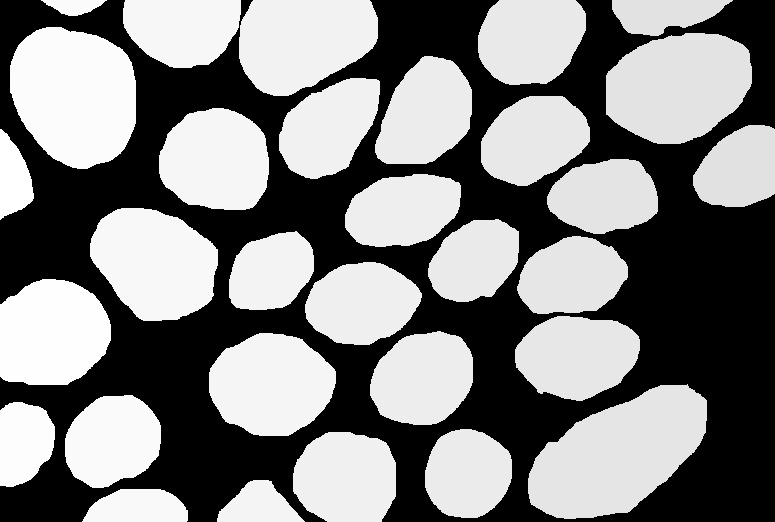</td>
<td>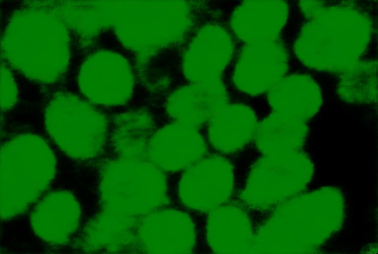</td>
</tr>

<tr>
<td>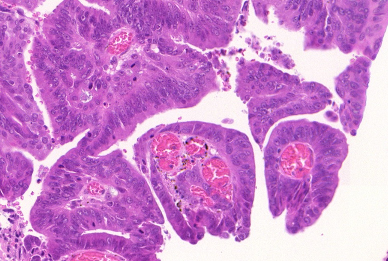</td>
<td></td>
<td>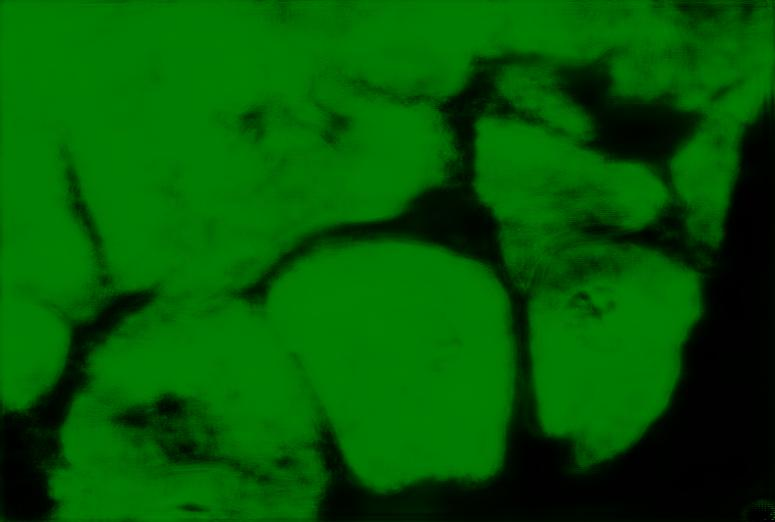</td>
</tr>

</table>

 
In this experiment, we have used the simple UNet Model 
<a href="./src/TensorflowUNet.py">TensorflowSlightlyFlexibleUNet</a> for this Oral Cancer Segmentation. 
As shown in <a href="https://github.com/sarah-antillia/Tensorflow-Image-Segmentation-API">Tensorflow-Image-Segmentation-API</a>.
you may try other Tensorflow UNet Models: 

<li><a href="./src/TensorflowSwinUNet.py">TensorflowSwinUNet.py</a></li>
<li><a href="./src/TensorflowMultiResUNet.py">TensorflowMultiResUNet.py</a></li>
<li><a href="./src/TensorflowAttentionUNet.py">TensorflowAttentionUNet.py</a></li>
<li><a href="./src/TensorflowEfficientUNet.py">TensorflowEfficientUNet.py</a></li>
<li><a href="./src/TensorflowUNet3Plus.py">TensorflowUNet3Plus.py</a></li>
<li><a href="./src/TensorflowDeepLabV3Plus.py">TensorflowDeepLabV3Plus.py</a></li>

 

<h3>1 Dataset Citation</h3>

The original dataset used here has been taken from the kaggle website: 
<a href="https://www.kaggle.com/datasets/sani84/glasmiccai2015-gland-segmentation">
GlaS@MICCAI'2015: Gland Segmentation
Gland Segmentation in Colon Histology Images Challenge</a>
 
 
<b>About Dataset</b> 
<b>Introduction</b> 
Glands are important histological structures which are present in most organ systems as the main mechanism for secreting proteins and carbohydrates.
It has been shown that malignant tumours arising from glandular epithelium, also known as adenocarcinomas, are the most prevalent form of cancer. 
The morphology of glands has been used routinely by pathologists to assess the degree of malignancy of several adenocarcinomas, including prostate,
breast, lung, and colon.
 
Accurate segmentation of glands is often a crucial step to obtain reliable morphological statistics. Nonetheless, the task by nature is very 
challenging due to the great variation of glandular morphology in different histologic grades. Up until now, the majority of studies 
focus on gland segmentation in healthy or benign samples, but rarely on intermediate or high grade cancer, and quite often, 
they are optimised to specific datasets.
 
In this challenge, participants are encouraged to run their gland segmentation algorithms on images of Hematoxylin and Eosin (H&E) 
stained slides, consisting of a variety of histologic grades. The dataset is provided together with ground truth annotations by 
expert pathologists. The participants are asked to develop and optimise their algorithms on the provided training dataset, and validate 
their algorithm on the test dataset.
 
<b>Data Usage</b> 
The dataset used in this competition is provided for research purposes only. Commercial uses are not allowed.
If you intend to publish research work that uses this dataset, you must cite our review paper to be published after the competition

K. Sirinukunwattana, J. P. W. Pluim, H. Chen, X Qi, P. Heng, Y. Guo, L. Wang, B. J. Matuszewski, E. Bruni, U. Sanchez, A. Böhm, O. Ronneberger, B. Ben Cheikh, D. Racoceanu, P. Kainz, M. Pfeiffer, M. Urschler, D. R. J. Snead, N. M. Rajpoot, "Gland Segmentation in Colon Histology Images: The GlaS Challenge Contest" http://arxiv.org/abs/1603.00275 [Preprint]

The details of the journal version will be available soon.

AND the following paper, wherein the same dataset was first used: 
K. Sirinukunwattana, D.R.J. Snead, N.M. Rajpoot, "A Stochastic Polygons Model for Glandular Structures in Colon Histology Images," in IEEE Transactions on Medical Imaging, 2015
doi: 10.1109/TMI.2015.2433900
 
<h3>2 GlaS-MICCAI2015 ImageMask Dataset</h3>
 If you would like to train this GlaS-MICCAI2015 Segmentation model by yourself,
please download the original dataset from kaggle website
<a href="https://www.kaggle.com/datasets/sani84/glasmiccai2015-gland-segmentation">GlaS@MICCAI'2015: Gland Segmentation</a>
,expanded it, and move the expanded <b>Warwick_QU_Dataset</b> under <b>./generator</b> directory as shown below. 
<pre>
./generator
├─Warwick_QU_Dataset
│  ├─testA_1.bmp
│  ├─testA_1_anno.bmp
  ...       
│  ├─testB_1.bmp
│  ├─testB_1_anno.bmp
  ...       
│  ├─train_1.bmp
│  ├─train_1_anno.bmp
  ...       

└─ImageMaskDatasetGenerator.py
     
</pre>
Next, please run the following  command for <a href="./generator/ImageMaskDatasetGenerator.py">ImageMaskDatasetGenerator.py
</a>
<pre>
>python ImageMaskDatasetGenerator.py
</pre> 
By this command, JPEG <b>GlaS-MICCAI2015</b> dataset will be created under <b>./dataset</b> folder. 
The testA*, testB* and train* files in <b>Warwick_QU_Dataset</b> folder will be divided into three 
<b>valid</b>,<b>train</b> and <b>test</b> subsets.    
<pre>
./dataset
└─GlaS-MICCAI2015
    ├─test
    │   ├─images
    │   └─masks
    ├─train
    │   ├─images
    │   └─masks
    └─valid
        ├─images
        └─masks
</pre>

<b>GlaS-MICCAI2015 Dataset Statistics</b> 
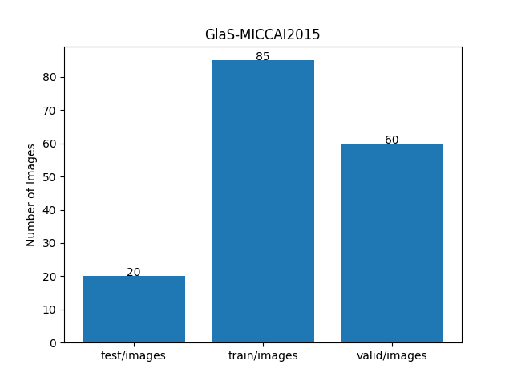 
 
As shown above, the number of images of train and valid dataset is extremely small. 
Probably, an online dataset augmentation strategy may be effective to improve segmentation accuracy.
 

 
<b>Train_images_sample</b> 
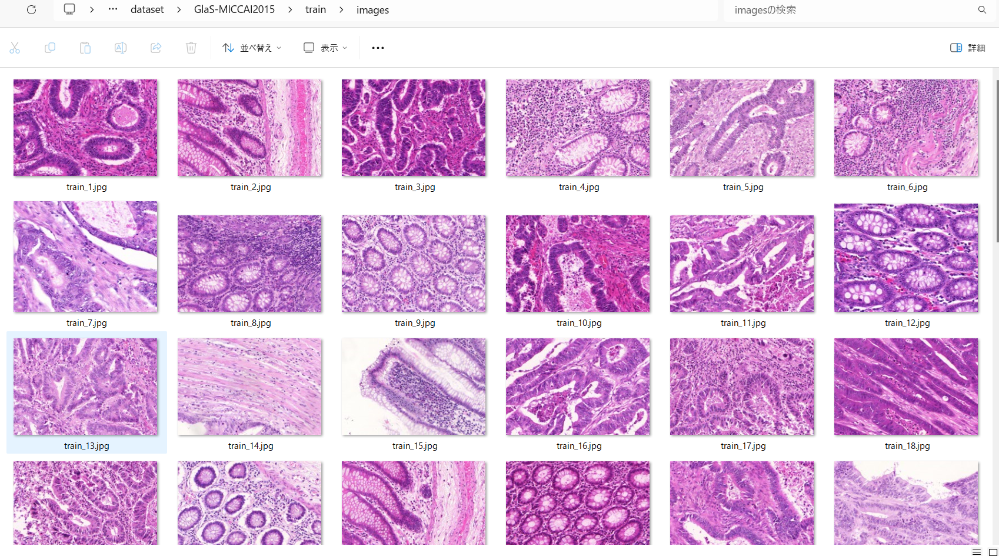
 
<b>Train_masks_sample</b> 
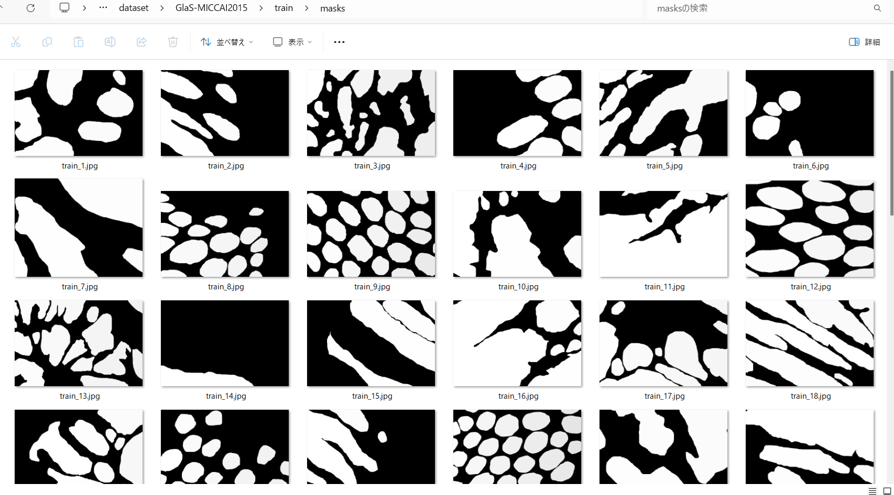
 

<h3>3 Train TensorflowUNet Model</h3>
 We have trained GlaS-MICCAI2015 TensorflowUNet Model by using the following
<a href="./projects/TensorflowSlightlyFlexibleUNet/GlaS-MICCAI2015/train_eval_infer.config"> <b>train_eval_infer.config</b></a> file.  
Please move to ./projects/GlaS-MICCAI2015 and run the following bat file. 
<pre>
>1.train.bat
</pre>
This simply runs the following command. 
<pre>
>python ../../../src/TensorflowUNetTrainer.py ./train_eval_infer.config
</pre>

<pre>
; train_eval_infer.config
; 2024/07/24 (C) antillia.com

[model]
model          = "TensorflowUNet"
generator      = True
image_width    = 512
image_height   = 512
image_channels = 3
input_normalize = False
normalization  = True
num_classes    = 1
base_filters   = 16
base_kernels   = (7,7)
num_layers     = 8
dropout_rate   = 0.03
learning_rate  = 0.00007
clipvalue      = 0.5
dilation       = (1,1)
;loss           = "bce_iou_loss"
loss           = "bce_dice_loss"
;metrics        = ["binary_accuracy"]
metrics        = ["dice_coef"]
show_summary   = False

[train]
epochs        = 100
batch_size    = 2
steps_per_epoch  = 240
validation_steps = 80
patience      = 10

;metrics       = ["iou_coef", "val_iou_coef"]
metrics       = ["dice_coef", "val_dice_coef"]
;metrics       = ["binary_accuracy", "val_binary_accuracy"]

model_dir     = "./models"
eval_dir      = "./eval"
image_datapath = "../../../dataset/GlaS-MICCAI2015/train/images/"
mask_datapath  = "../../../dataset/GlaS-MICCAI2015/train/masks/"

;Inference execution flag on epoch_changed
epoch_change_infer     = True

; Output dir to save the inferred masks on epoch_changed
epoch_change_infer_dir =  "./epoch_change_infer"

;Tiled-inference execution flag on epoch_changed
epoch_change_tiledinfer     = False

; Output dir to save the tiled-inferred masks on epoch_changed
epoch_change_tiledinfer_dir =  "./epoch_change_tiledinfer"

; The number of the images to be inferred on epoch_changed.
num_infer_images       = 1
create_backup  = False

learning_rate_reducer = True
reducer_factor     = 0.2
reducer_patience   = 4
save_weights_only  = True

[eval]
image_datapath = "../../../dataset/GlaS-MICCAI2015/valid/images/"
mask_datapath  = "../../../dataset/GlaS-MICCAI2015/valid/masks/"

[test] 
image_datapath = "../../../dataset/GlaS-MICCAI2015/test/images/"
mask_datapath  = "../../../dataset/GlaS-MICCAI2015/test/masks/"

[infer] 
images_dir    = "./mini_test/images"
output_dir    = "./mini_test_output"

[segmentation]
colorize      = True
black         = "black"
white         = "green"
blursize      = None

[image]
color_converter = None
gamma           = 0

[mask]
blur      = False
blur_size = (3,3)
binarize  = False
;threshold = 128
threshold = 80

[generator]
debug        = False
augmentation = True

[augmentor]
vflip    = True
hflip    = True
rotation = True
angles   = [30, 60, 90, 120, 150,180, 210, 240, 270, 300, 330]
shrinks  = [0.8]
shears   = [0.1]

deformation = True
distortion  = True
sharpening  = False
brightening = False
barrdistortion = True

[deformation]
alpah     = 1300
sigmoids  = [8.0]

[distortion]
gaussian_filter_rsigma= 40
gaussian_filter_sigma = 0.5
distortions           = [0.02,0.03]

[barrdistortion]
radius = 0.3
amount = 0.3
centers =  [(0.3, 0.3), (0.7, 0.3), (0.5, 0.5), (0.3, 0.7), (0.7, 0.7)]

[sharpening]
k        = 1.0

[brightening]
alpha  = 1.2
beta   = 10  
</pre>

<b>Model parameters</b> 
Defined small <b>base_filters</b> and large <b>base_kernels</b> for the first Conv Layer of Encoder Block of 
<a href="./src/TensorflowUNet.py">TensorflowUNet.py</a> 
and large num_layers (including a bridge between Encoder and Decoder Blocks).
<pre>
[model]
base_filters   = 16 
base_kernels   = (7,7)
num_layers     = 8
</pre>

<b>Online augmentation</b> 
Enabled our online augmentation.  
<pre>
[model]
model         = "TensorflowUNet"
generator     = True
</pre>

<b>Loss and metrics functions</b> 
Specified "bce_dice_loss" and "dice_coef".
<pre>
[model]
loss           = "bce_dice_loss"
metrics        = ["dice_coef"]
</pre>
<b>Learning rate reducer callback</b> 
Enabled learing_rate_reducer callback. 
<pre> 
[train]
reducer_factor     = 0.2
reducer_patience   = 5
save_weights_only  = True
</pre>
<b>Early stopping callback</b> 
Enabled early stopping callback with patience parameter.
<pre>
[train]
patience      = 10
</pre>

<b>Epoch change inference callback</b> 
Enabled EpochChange infer callback.
<pre>
[train]
epoch_change_infer     = True
epoch_change_infer_dir =  "./epoch_change_infer"
num_infer_images       = 1
</pre>

By using this EpochChangeInference callback, on every epoch_change, the inference procedure can be called
 for an image in <b>mini_test</b> folder. This will help you confirm how the predicted mask changes at each epoch during your training process.    

<b>Epoch_change_inference output</b> 
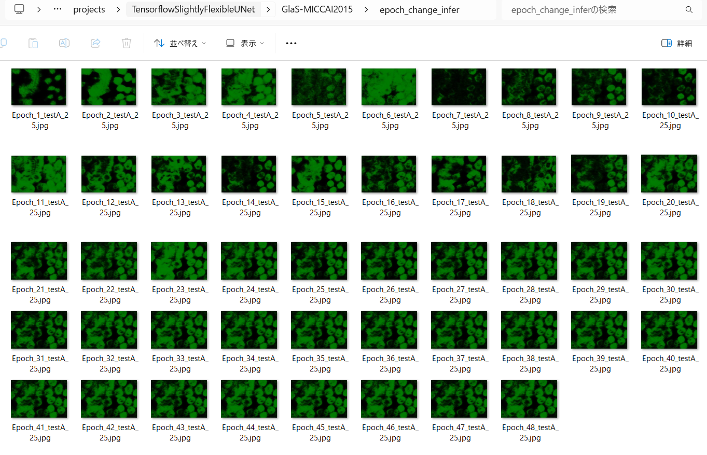 
 
 
In this case, the training process stopped at epoch 48 by EarlyStopping Callback as shown below. 
<b>Training console output</b> 
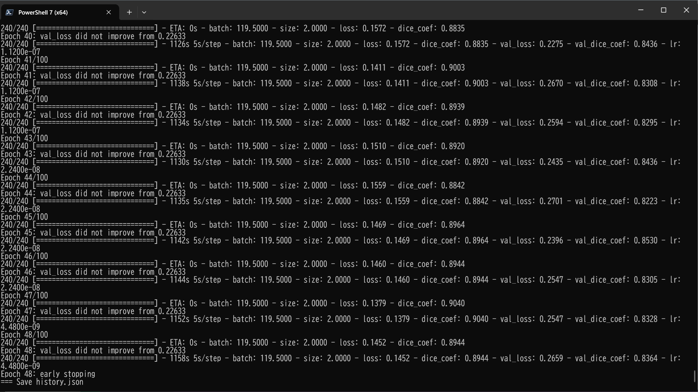 
 
 
<a href="./projects/TensorflowSlightlyFlexibleUNet/GlaS-MICCAI2015/eval/train_metrics.csv">train_metrics.csv</a> 
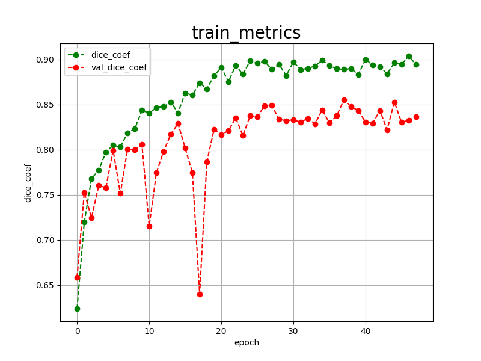 

 
<a href="./projects/TensorflowSlightlyFlexibleUNet/GlaS-MICCAI2015/eval/train_losses.csv">train_losses.csv</a> 
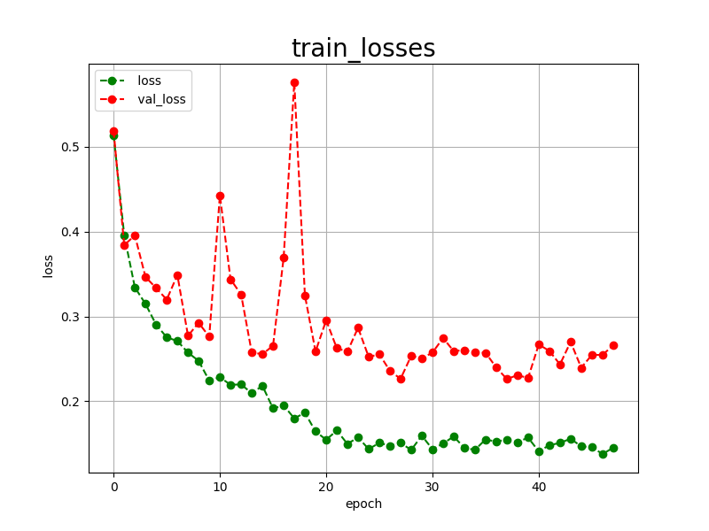 

 

<h3>4 Evaluation</h3>
Please move to a <b>./projects/TensorflowSlightlyFlexibleUNet/GlaS-MICCAI2015</b> folder, 
and run the following bat file to evaluate TensorflowUNet model for GlaS-MICCAI2015. 
<pre>
./2.evaluate.bat
</pre>
This bat file simply runs the following command.
<pre>
python ../../../src/TensorflowUNetEvaluator.py ./train_eval_infer_aug.config
</pre>

<b>Evaluation console output</b> 
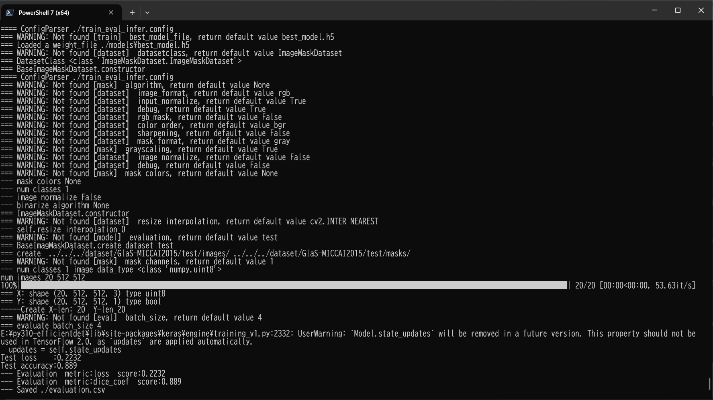
  

<a href="./projects/TensorflowSlightlyFlexibleUNet/GlaS-MICCAI2015/evaluation.csv">evaluation.csv</a> 

The loss (bce_dice_loss) for this test is not so low, and dice_coef not high. 
<pre>
loss,0.2232
dice_coef,0.889
</pre>

<h3>
5 Inference
</h3>
Please move to a <b>./projects/TensorflowSlightlyFlexibleUNet/GlaS-MICCAI2015</b> folder 
,and run the following bat file to infer segmentation regions for images by the Trained-TensorflowUNet model for GlaS-MICCAI2015. 
<pre>
./3.infer.bat
</pre>
This simply runs the following command.
<pre>
python ../../../src/TensorflowUNetInferencer.py ./train_eval_infer_aug.config
</pre>

<b>mini_test_images</b> 
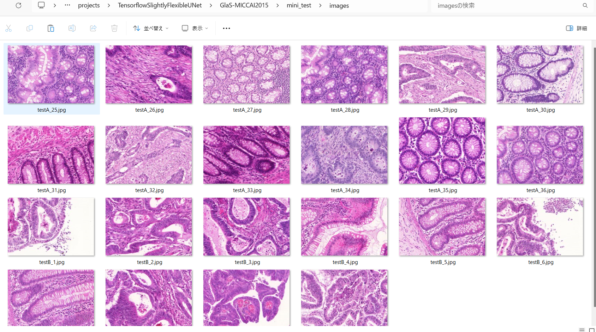 
<b>mini_test_mask(ground_truth)</b> 
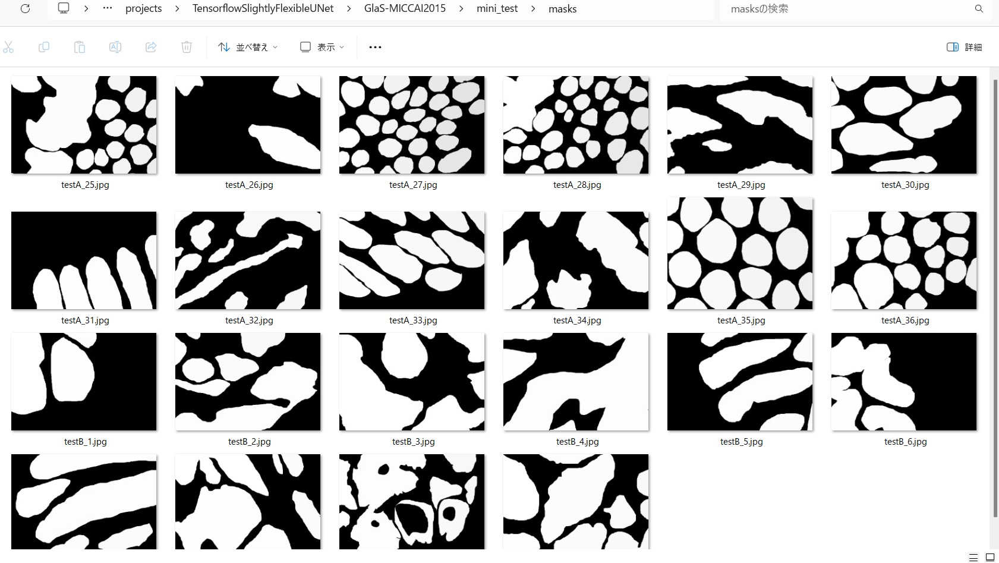 

<b>Inferred test masks</b> 
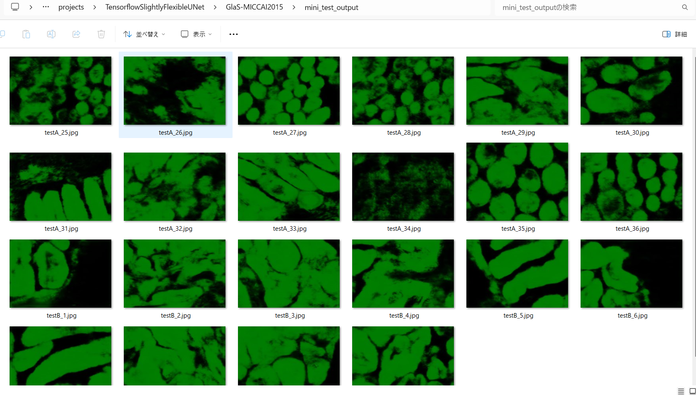 
 

<b>Enlarged Images and Masks Comparison</b> 
<table>
<tr>
<th>Image</th>
<th>Mask (ground_truth)</th>
<th>Inferred-mask</th>
</tr>

<tr>
<td>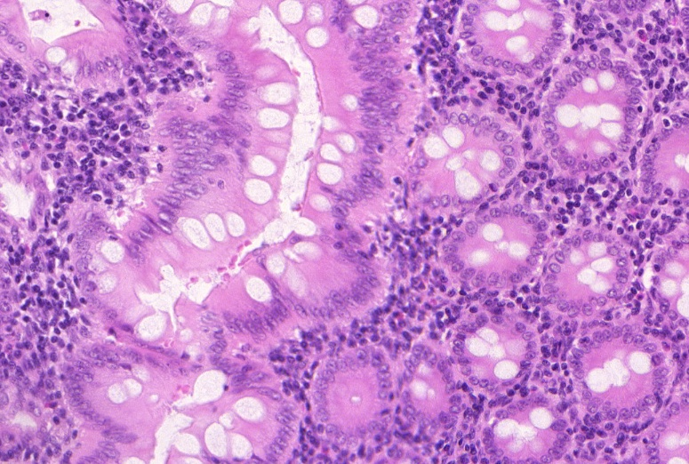</td>
<td>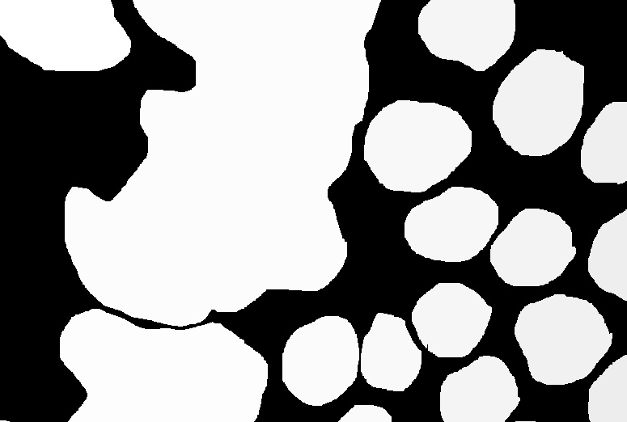</td>
<td>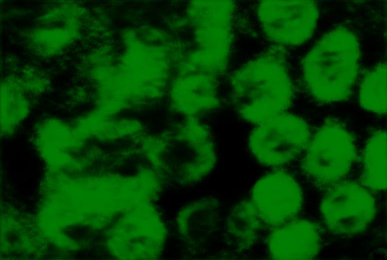</td>
</tr>

<tr>
<td></td>
<td></td>
<td></td>
</tr>

<tr>
<td>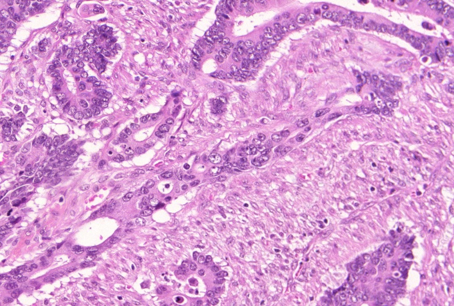</td>
<td></td>
<td>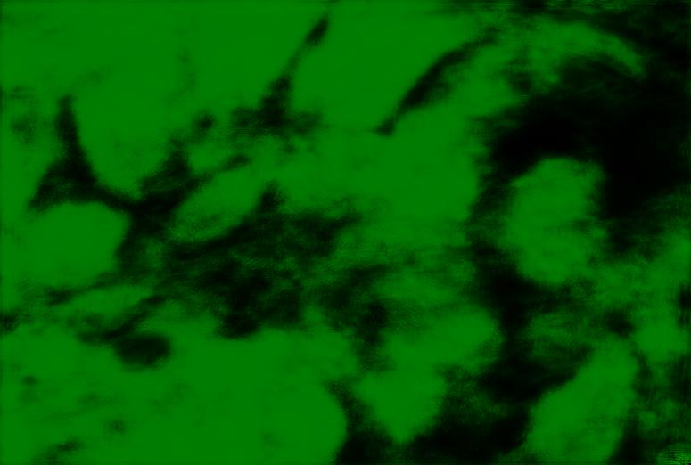</td>
</tr>

<tr>
<td>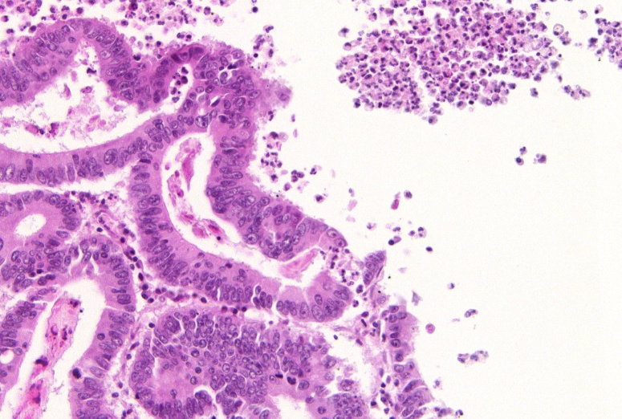</td>
<td></td>
<td>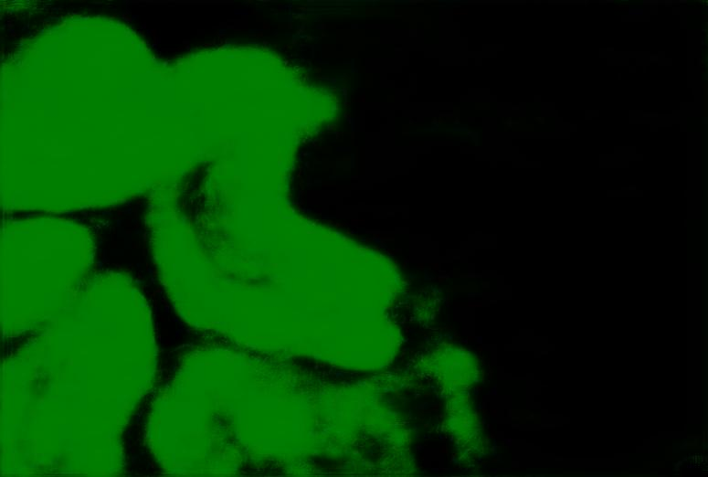</td>
</tr>

<tr>
<td></td>
<td></td>
<td></td>
</tr>

</table>

 
 

<h3>
Reference
</h3>
<b>1. Gland Segmentation in Colon Histology Images: The GlaS Challenge Contest</b> 

Korsuk Sirinukunwattana, Josien P. W. Pluim, Hao Chen, Xiaojuan Qi, Pheng-Ann Heng, Yun Bo Guo,  
Li Yang Wang, Bogdan J. Matuszewski, Elia Bruni, Urko Sanchez, Anton Böhm, Olaf Ronneberger,  
Bassem Ben Cheikh, Daniel Racoceanu, Philipp Kainz, Michael Pfeiffer, Martin Urschler,  
David R. J. Snead, Nasir M. Rajpoot  
https://doi.org/10.48550/arXiv.1603.00275 

<a href="https://ar5iv.labs.arxiv.org/html/1603.00275">https://ar5iv.labs.arxiv.org/html/1603.00275</a>

 
